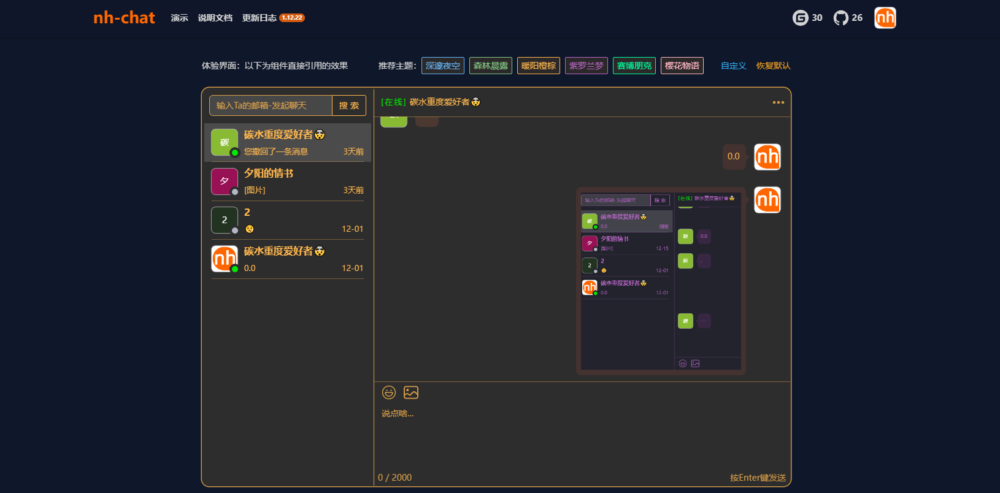
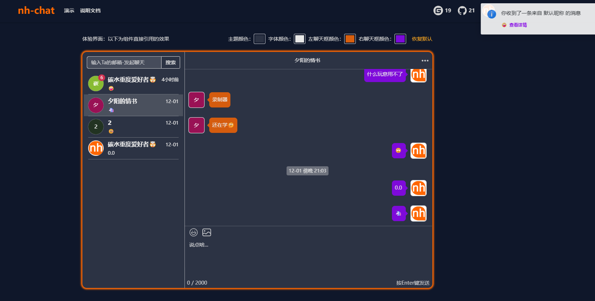
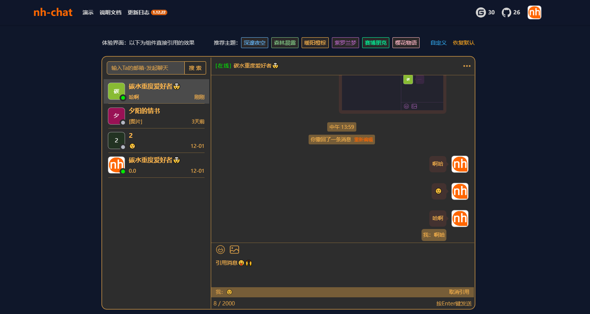
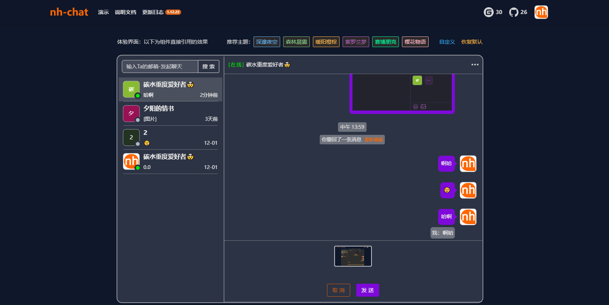
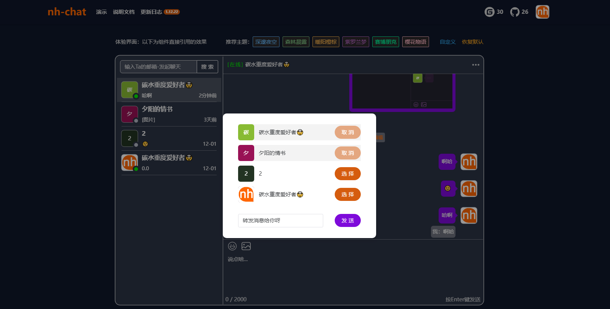

# <p align="center"></p>

<h3 align="center">Complete source code</h3>
<h3 align="center">Clear documentation</h3>
<h3 align="center">Easy to use, not exaggerated chat framework🥰</h3>

<div align="center">
  <a href="https://github.com/sniHao/nh-chat">
    
  </a>
  <a href="https://gitee.com/snihao/nh-chat">
    
  </a>
</div>

<p align="center"><a href="README-en.md">中文</a> | English</p>

## Project introduction👋

This framework adopts the cutting-edge technology route, more popular, concise code, detailed comments. We welcome your valuable comments and code contributions 🤝
The framework is completely open source, can be used anywhere, can also be developed twice 🤩 in personal or commercial time, hope you can be famous source, thank you.
The purpose of developing this framework is to make it convenient to access more functional message modules in individual or enterprise projects.

Code open source address：[GitHub](https://github.com/sniHao/nh-chat) &nbsp;&nbsp;&nbsp;[Gitee](https://gitee.com/snihao/nh-chat)

Project experience address：[https://www.snihao.top](https://www.snihao.top)

## Function introduction😎

- Style theme custom, how to look how to change 🎨
- Traffic limiting on the message interface prevents malicious traffic brushing 👾
- Message global notifications, get notifications of new messages anywhere on the site, and quickly check 🚀
- Basically suitable for mobile terminals, convenient for mobile terminals to use 📱
- When you chat with them, messages will be pushed in real time 👋
- Support regular chat: text, memes, pictures, etc 😎
- Message basic functions: forward, reply, withdraw, delete, batch processing, copy and so on 🤠
- Address book basic functions: friend search, friend top, friend delete 👨‍🚀

## Function display🚀

- Home page


- Style theme custom

<div style="display: flex; justify-content: space-between;">
    
    
</div>

- Message notification



- Chat function

<div style="display: flex; justify-content: space-between;">
    
    
</div>

<div style="display: flex; justify-content: space-between;margin-top: 2px">
    
    
</div>

## Download🤖

The node.js version is **v18.18.0** and the npm version is **9.8.1**

jdk version is **17.0.8**, maven version is **3.8.1**

It is recommended to use an equal or higher version, otherwise some problems may occur.

For details, see the official website：[https://www.snihao.top/docs/down](https://www.snihao.top/docs/down)

### Front mounting

Install using npm。

```bash
npm i nh-chat
```

### Back-end installation

Download the SDK package below, unzip it, move it to your maven repository, and finally introduce it into your project。

Download address：[SDK package](https://www.snihao.top/im/sdk/nh.zip)

```java
<dependency>
<groupId>nh.chat</groupId>
<artifactId>nh-chat-rear</artifactId>
<version>1.10.28</version>
</dependency>
```

### SQL file installation

Download the following SQL file and import it into your database。

Download address：[SQL File](https://www.snihao.top/im/sql/nh-chat.sql)

## Last word☕

After completing the above 3 steps, you are ready to use the chat framework 🎉.

Yeah, that's right. It's that quick and easy. But it should be noted that the above steps are completed. It can only be used for personal experience, connected to online projects, and requires some simple configuration.

**Thanks for your support!**

## Need help🤔

If you encounter any problems during the operation, you can contact me at any time and I will do my best to help.
If you find any bugs, please contact me and I will fix them as soon as possible.

- Mail：<snihao6@qq.com>
- GitHub：[GitHub](https://github.com/sniHao/nh-chat/issues)
- Gitee：[Gitee](https://gitee.com/snihao/nh-chat/issues)