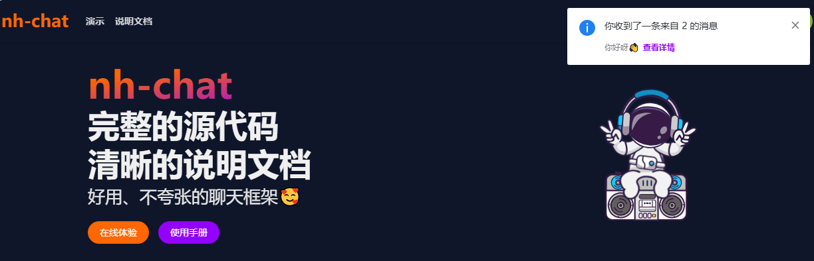
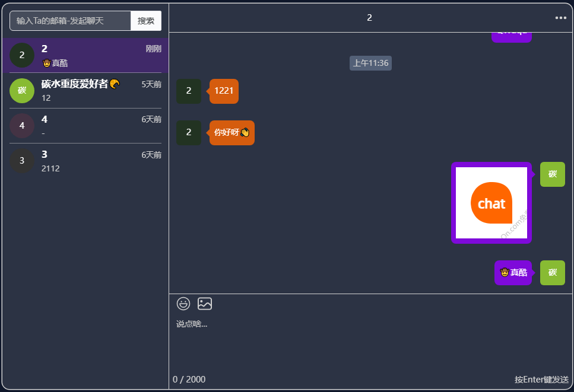
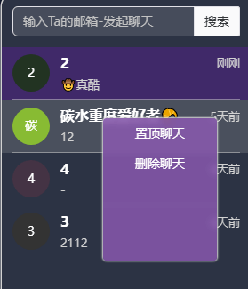
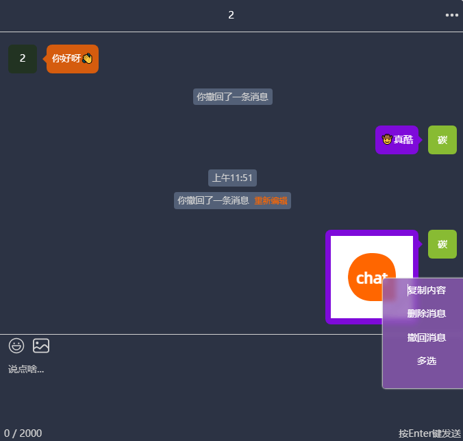

# <p align="center"></p>
<div style="text-align: center;font-size:36px"><strong>完整的源代码</strong></div>
<div style="text-align: center;font-size:36px"><strong>清晰的说明文档</strong></div>
<div style="text-align: center;font-size:36px"><strong>好用、不夸张的聊天框架🥰</strong></div>

## 项目介绍👋

本框架采用前沿技术路线，更大众化、代码简洁、注释详细。欢迎大家提出宝贵意见、贡献代码🤝
该框架完全开源，可以在任何地方使用，也可以二次开发🤩在个人或商用时，希望您能著名来源，谢谢。
开发该框架的目的，为了方便在个人或企业项目中，更方便快捷的接入功能较完善的消息模块。

代码开源地址：
- [GitHub](https://github.com/sniHao/nh-chat)
- [Gitee](https://gitee.com/snihao/nh-chat)

代码体验地址：[https://www.notes-something.fun](https://www.notes-something.fun)

## 功能介绍😎
- 消息全局通知，不论在网站任何地方都会收到新消息通知，并且快速查看🚀
- 基本适配移动端，方便手机端使用📱
- 与Ta聊天时，消息会实时推送给对方👋
- 支持常规的聊天、如文字、表情包、图片等等😎
- 消息基础功能：消息状态、消息撤回、消息删除、消息批量处理、消息复制等等🤠
- 通讯录基础功能：好友搜索、好友置顶、好友删除👨‍🚀

## 功能展示🚀
- 消息全局通知



- 聊天框-整体



- 聊天框-通讯录



- 聊天框-消息



## 下载🤖
先将该项目clone到本地，需要注意的是，该项目的node.js版本为**v18.18.0**，npm版本为**9.8.1**，建议使用差距不那么大的版本，否则可能会出现一些问题。

**安装依赖**
```bash
npm i
```
**启动项目**
```bash
npm run dev
```
需要注意的是，项目中存在后端接口，需要你结合自己项目的后端去做修改，详细的目录结构在体验网站的文档中会有介绍。若未启动后端接口，会有服务连接失败等等弹窗，可以自行调整这些操作。未启动后端服务，可以进行体验但不会进行数据保存。详细的文档请参考**项目结构**。

## 最后唠叨☕
该项目因为是聊天框架，对于接口，不同的业务会有不同的需求，所以未对接口和数据库进行开源。

若打算使用本框架的后端接口、数据库等服务，可联系<snihao6@qq.com>📮，请注明来意。

**感谢您的支持！**

## 需要帮助🤔
如果你在操作过程中遇到问题，可以随时联系我，我会尽我所能提供帮助。
若发现bug也可以联系我，我会尽快修复。
- 邮箱：<snihao6@qq.com>
- GitHub：[GitHub](https://github.com/sniHao/nh-chat/issues)
- Gitee：[Gitee](https://gitee.com/snihao/nh-chat/issues)