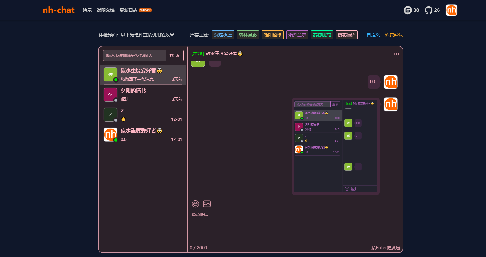

# <p align="center"></p>

<h3 align="center">完整的源代码</h3>
<h3 align="center">清晰的说明文档</h3>
<h3 align="center">好用、不夸张的聊天框架🥰</h3>

## 项目介绍👋

本框架采用前沿技术路线，更大众化、代码简洁、注释详细。欢迎大家提出宝贵意见、贡献代码🤝
该框架完全开源，可以在任何地方使用，也可以二次开发🤩在个人或商用时，希望您能著名来源，谢谢。
开发该框架的目的，为了方便在个人或企业项目中，更方便快捷的接入功能较完善的消息模块。

代码开源地址：

- [GitHub](https://github.com/sniHao/nh-chat)
- [Gitee](https://gitee.com/snihao/nh-chat)

代码体验地址：[https://www.snihao.top](https://www.snihao.top)

## 功能介绍😎

- 样式主题自定义，怎么好看怎么改🎨
- 消息接口限流，防止恶意刷流👾
- 消息全局通知，不论在网站任何地方都会收到新消息通知，并且快速查看🚀
- 基本适配移动端，方便手机端使用📱
- 与Ta聊天时，消息会实时推送👋
- 支持常规的聊天：如文字、表情包、图片等等😎
- 消息基础功能：转发、回复、撤回、删除、批量处理、复制等等🤠
- 通讯录基础功能：好友搜索、好友置顶、好友删除👨‍🚀

## 功能展示🚀

- 官网首页


- 样式主题自定义

<div style="display: flex; justify-content: space-between;">
    
    
</div>

- 消息通知


- 聊天功能

<div style="display: flex; justify-content: space-between;">
    
    
</div>

<div style="display: flex; justify-content: space-between;margin-top: 2px">
    
    
</div>

## 下载🤖

node.js版本为**v18.18.0**，npm版本为**9.8.1**

jdk版本为**17.0.8**，maven版本为**3.8.1**

建议使用相等或以上的版本，否则可能会出现一些问题。

详细配置请查看官网：[https://www.snihao.top/docs/down](https://www.snihao.top/docs/down)

### 前端安装

使用 npm 安装。

```bash
npm i nh-chat
```

### 后端安装

下载下面的SDK包，解压移动到你的maven仓库中，最后在你的项目中引入。

下载地址：[SDK压缩包](https://www.snihao.top/im/sdk/nh.zip)

```java
<dependency>
<groupId>nh.chat</groupId>
<artifactId>nh-chat-rear</artifactId>
<version>1.10.28</version>
</dependency>
```

### SQL文件安装

下载下面的SQL文件，导入到你的数据库中。
下载地址：[SQL文件](https://www.snihao.top/im/sql/nh-chat.sql)

## 最后唠叨☕

完成以上3步，就可以开始使用聊天框架了🎉。

对的没错，就是这么快捷方便。但需要注意的是，以上步骤完成。只能用于个人体验，接入到线上项目中，还需要进行一些简单的配置。

**感谢您的支持！**

## 需要帮助🤔

如果你在操作过程中遇到问题，可以随时联系我，我会尽我所能提供帮助。
若发现bug也可以联系我，我会尽快修复。

- 邮箱：<snihao6@qq.com>
- GitHub：[GitHub](https://github.com/sniHao/nh-chat/issues)
- Gitee：[Gitee](https://gitee.com/snihao/nh-chat/issues)